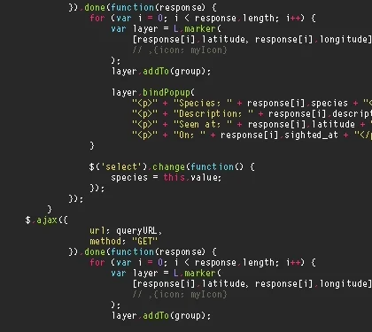

<h1 align="center"> Hi🫰 i am Sid here</h1>

# 💫 About Me:

🔭 I’m currently working on Devops Technologies 👯 I’m looking to collaborate on Open source 🤝 I’m looking for help with flutter programming 🌱 I’m currently learning DSA 

## 🌐 Socials:
   

# 💻 Tech Stack:
                                             
# 📊 GitHub Stats:
 
 

## 🏆 GitHub Trophies

### ✍️ Random Dev Quote

---

<!-- Proudly created with GPRM ( https://gprm.itsvg.in ) -->
